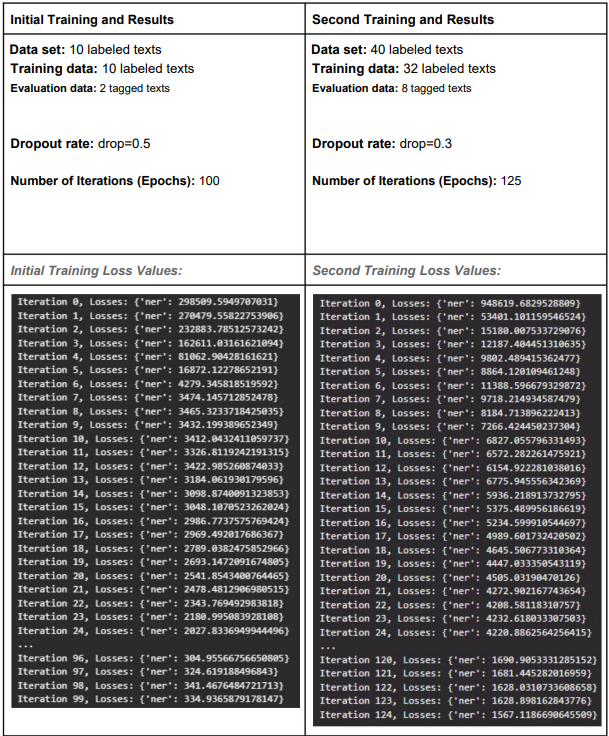
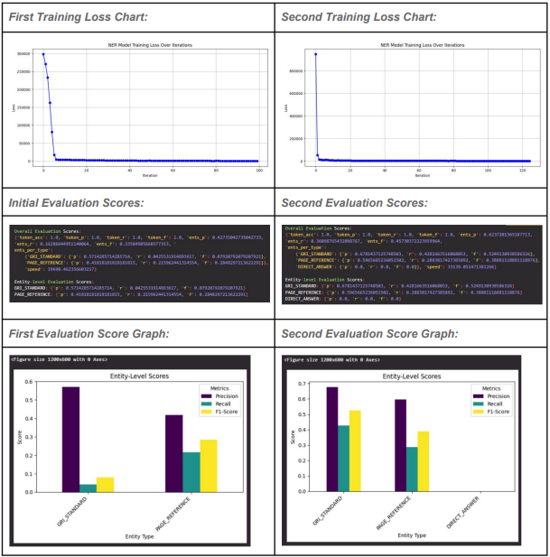

This project uses a Named Entity Recognition (NER) model to identify Global Reporting Initiative (GRI) sections in sustainability reports. JSON reports are converted to text, analyzed, and processed to automatically identify GRI sections and page references. The project also involves creating and evaluating the NER model using NLP techniques to enhance accuracy and relevance.

Here’s a table summarizing the project files and their descriptions:

| **File/Folder**       | **Description**                                                                                                                                                                                  |
| --------------------- | ------------------------------------------------------------------------------------------------------------------------------------------------------------------------------------------------ |
| `custom_ner_model`    | The supervised NER model used to label entities in the text files.                                                                                                                               |
| `flatten_json`        | Contains the original JSON files that include the PDF texts to be converted into TXT files. **The file size is too large to upload to GitHub. You need to click [here](https://drive.google.com/file/d/1tgh6-CVhj5S5tRH-vmYX_b9kbWoEp907/view?usp=sharing) to download it.**                                                                                                     |
| `gri_sections_pdfs`   | The folder where the GRI sections from the PDFs in the new_pdfs directory are saved as new PDF outputs.                                                                                                                                                                                                  |
| `new_pdfs`            | Original PDF files from which text was extracted. **The file size is too large to upload to GitHub. You need to click [here](https://drive.google.com/file/d/1dSTeHxyCcCgbMX_KIvK7rGNJRgd6kKcI/view?usp=sharing) to download it.**                                                                                                                                                |
| `new_pdfs_demo`       | A smaller portion of new_pdfs. (The original data was very large, causing long runtimes, so a smaller portion was used for output checks.)                                                       |
| `reports`             | Raw, unlabeled text files corresponding to reports processed from the original PDFs. Used as input for the NER model. **The file size is too large to upload to GitHub. You need to click [here](https://drive.google.com/file/d/1sV1Ep9D9nsyGiEiElmZXEg-dvmsPdQxP/view?usp=drivesdk)to download it.**                                                                             |
| `reports_annotations` | Labeled JSON files containing annotations from the NER model for the corresponding reports.                                                                                                      |
| `reports_demo`        | Raw, unlabeled text files corresponding to reports processed from the original PDFs. (The original data was very large, causing long runtimes, so a smaller portion was used for output checks.) |
| `Model.ipynb` | The Main Model, a pipeline or collection of scripts that processes text data, applies entity recognition, and generates the final output. |
| `NER Annotation Tool User Guide.pdf` | A guide for the annotation process, essential for understanding how the labeled data was created. |
| `reports_checkpoint.json` | Saves progress in processing `reports_dict` to ensure continuity. |
| `reports_with_gri_table_list.txt` | File containing list of reports with gri table. |
| `THINGS TO CONSIDER WHEN LABELING.pdf` | A guide for the annotation process, essential for understanding how the labeled data was created. |

## Project Workflow and Steps:

### 1. Conversion of JSON Files

- **Objective:** Convert JSON files in the `flatten_json` folder to TXT files. Each PDF text within a JSON file is saved separately as a TXT file.
- **Technologies:** Python, JSON, File I/O
- **Description:** The JSON files are processed to extract the text from PDFs, which are then saved as TXT files. The file names are generated by combining the `report_id` and the `PDF` key.

### 2. Separation of Files Containing GRI Tables

- **Objective:** Identify and separate TXT files that contain GRI tables.
- **Technologies:** Python, Regex
- **Description:** Regular expressions are used to scan the TXT files and identify those containing GRI tables. These files are flagged for further processing.

### 3. Manual Annotation

- **Objective:** Manually annotate TXT files containing GRI tables with `PAGE_REFERENCE`, `DIRECT_ANSWER`, and `GRI_STANDARD` labels.
- **Technologies:** NER Annotation Tool
- **Description:** The identified TXT files are manually annotated using the NER Annotation Tool. The annotations are saved in JSON format for use in model training.

### 4. Training the NER Model

- **Objective:** Train the NER model using the labeled data.
- **Technologies:** SpaCy, Python
- **Description:** The labeled JSON files are divided into training (80%) and evaluation (20%) datasets. The NER model is trained using these datasets and saved as `nlp`.

### 5. Processing TXT Files with the NER Model

- **Objective:** Process all TXT files using the trained NER model.
- **Technologies:** SpaCy, Python
- **Description:** The trained NER model is applied to all TXT files to extract entities. The labeled data is collected and processed for further analysis.

### 6. Storing Results in a Dictionary

- **Objective:** Store the results of the NER model in a structured format.
- **Technologies:** Python, Dictionaries
- **Description:** The extracted entities are stored in a dictionary named `reports_dict`:
  ```python
  reports_dict[report_id] = {
      "page_references": process_page_references(page_references),
      "direct_answers": process_direct_answers(direct_answers),
      "gri_standards": gri_standards
  }
  ```

### 7. Matching with PDF Files

- **Objective:** Match the extracted results with the original PDF files.
- **Technologies:** Python, File I/O
- **Description:** The `report_id` values in `reports_dict` are matched with the original PDF files for further processing.

### 8. Generating Outputs

- **Objective:** Generate the final outputs based on the processed data.
- **Technologies:** Python, PDF Processing
- **Description:** Two types of outputs are generated:
  1. If `direct_answers` are found, they are printed. If `page_references` exist, the corresponding text from the PDF pages is retrieved.
  2. If `direct_answers` are found, they are printed. If `page_references` exist, the corresponding PDF pages are saved as a separate PDF file in the `modified_reports` folder.

## Technologies Used:

- **Python:** The primary programming language used for all project steps.
- **SpaCy:** The Python library used for NLP tasks and training the NER model.
- **JSON:** The data format used to store the reports.
- **Matplotlib and Seaborn:** Libraries used for visualizing model performance.
- **Pandas:** A data analysis library used for organizing and inspecting data.

## Results of Training and Evaluation

The NER model was trained twice by increasing the data set and changing the parameters. We ran
the modeling consisting of tagged pdf texts each time and recorded the results. We compared the
results of the two trainings below:




These results show that the model's performance improves significantly when trained with
more data and optimized parameters.

- More data was used in the second training, which allowed the model to generalize better.
- A lower dropout rate was used in the second training, which helped the model to overfit less.
- In both trainings, the loss values decreased as the iterations progressed, but in the second training,
  a faster decrease was observed even though the initial loss value was much higher.
- In the second training, a significant improvement was seen in entity precision, recall and F1 scores.
